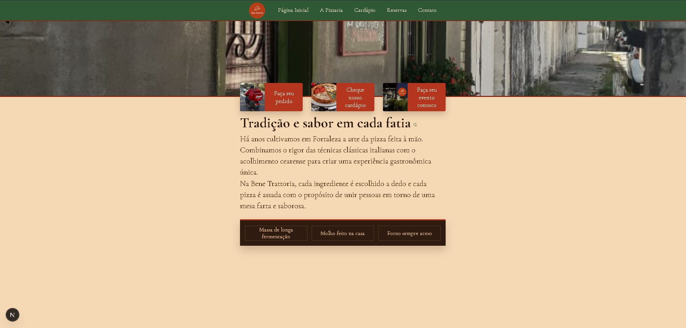
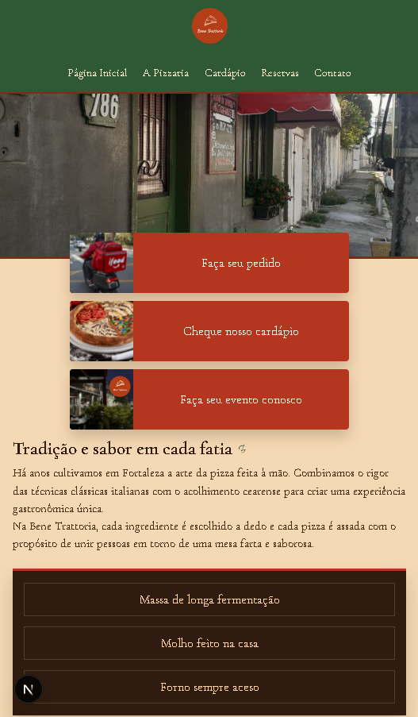

# 🍝 Bene Trattoria

A modern and elegant Italian restaurant landing page built with cutting-edge frontend technologies.  
This project focuses on delivering a premium user experience with responsive design, smooth animations, and clean architecture.

---

## 📸 Preview






## ✨ Features

- ⚡ Modern and responsive UI
- 🎨 Elegant Italian restaurant design
- 📱 Fully mobile responsive
- 🌙 Smooth animations and transitions
- 🍕 Dynamic menu presentation
- 📍 Contact and reservation sections
- 🚀 Optimized performance
- 🧩 Component-based architecture
- 🎯 Clean and scalable code structure

---

## 🛠️ Technologies Used

This project was built using modern frontend tools and libraries:

- ⚛️ React
- 🔷 TypeScript
- ⚡ Vite
- 🎨 Tailwind CSS
- 🎞️ Framer Motion
- 🧩 shadcn/ui
- 🖼️ Lucide React

---

## 📂 Project Structure

```bash
Bene_Trattoria/
├── public/
├── src/
│   ├── assets/
│   ├── components/
│   ├── sections/
│   ├── hooks/
│   ├── lib/
│   ├── styles/
│   ├── App.tsx
│   └── main.tsx
├── package.json
├── tsconfig.json
└── vite.config.ts
```

---

## 🚀 Getting Started

### Prerequisites

Make sure you have installed:

- Node.js >= 18
- npm or yarn

---

## ⚙️ Installation

Clone the repository:

```bash
git clone https://github.com/AlekLima/Bene_Trattoria.git
```

Navigate to the project folder:

```bash
cd Bene_Trattoria
```

Install dependencies:

```bash
npm install
```

---

## ▶️ Running the Project

Start the development server:

```bash
npm run dev
```

The application will be available at:

```bash
http://localhost:5173
```

---

## 📦 Build for Production

Generate the production build:

```bash
npm run build
```

Preview the production version locally:

```bash
npm run preview
```

---

## 🎨 Design Goals

The objective of this project is to simulate a premium Italian restaurant digital experience with focus on:

- Visual storytelling
- Elegant typography
- Smooth navigation
- Mobile-first responsiveness
- Modern UI/UX principles

---

## 📱 Responsive Design

The interface was designed to work seamlessly across:

- 📱 Mobile devices
- 📲 Tablets
- 💻 Laptops
- 🖥️ Desktop screens

---

## 🧠 What I Practiced in This Project

- Component architecture
- Responsive layouts
- Animation integration
- Modern frontend workflows
- UI composition
- Clean code organization
- Performance optimization

---

## 📌 Future Improvements

- [ ] Online reservation system
- [ ] Backend integration
- [ ] Authentication
- [ ] CMS integration
- [ ] Internationalization (i18n)
- [ ] Dark mode
- [ ] SEO improvements

---

## 🤝 Contributing

Contributions are welcome.

1. Fork the project
2. Create a feature branch

```bash
git checkout -b feature/amazing-feature
```

3. Commit your changes

```bash
git commit -m "Add amazing feature"
```

4. Push to the branch

```bash
git push origin feature/amazing-feature
```

5. Open a Pull Request

---

## 📄 License

This project is licensed under the MIT License.

---

## 👨‍💻 Author

Developed by [Alek Lima](https://github.com/AlekLima)

- GitHub: [@AlekLima](https://github.com/AlekLima)
- LinkedIn: Add your LinkedIn here

---

## ⭐ Support

If you liked this project:

- Leave a ⭐ on the repository
- Share it with others
- Follow me on GitHub

---

## 🔗 Repository

[Bene_Trattoria Repository](https://github.com/AlekLima/Bene_Trattoria)